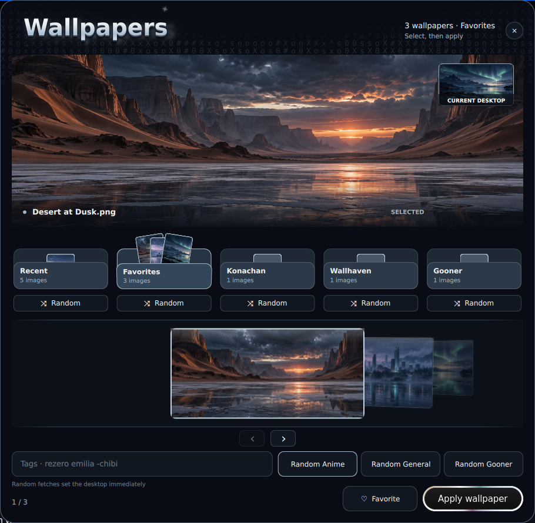

**A cinematic wallpaper picker for NixOS and Hyprland.** Browse saved images, preview them in a drifting gallery, apply one when you are ready, or fetch something new from Konachan and Wallhaven. The Quickshell interface and wallpaper backend ship together in one flake.

## Quick start

Run without installing:

```sh
nix run github:ilqqy/wallpick
```

Open, toggle, or close the popup:

```sh
nix run github:ilqqy/wallpick -- open
nix run github:ilqqy/wallpick -- toggle
nix run github:ilqqy/wallpick -- close
```

Install into your user profile for a short `wallpick` command:

```sh
nix profile add github:ilqqy/wallpick
wallpick open
```

Requires a **Wayland session with layer-shell support**. NixOS + Hyprland is the tested setup. The package includes Quickshell, `awww`, image validation, and the download tools; no Fish functions, API keys, or edits to your NixOS configuration are needed.

## Preview

<p align="center">
  
</p>

The screenshot uses original sample wallpapers created for this project.

## How it works

Select a wallpaper in the gallery to update the large preview. **Apply wallpaper** sets it on your desktop. Selection alone never changes your wallpaper.

Each source card has a circular shuffle control. In **Recent** and **Favorites**, it chooses a saved image for preview. In **Konachan**, **Wallhaven**, and **Gooner**, it downloads and applies a new image immediately. The tag field accepts queries such as `rezero emilia -chibi` or `dark forest`; press **Fetch** or Enter to use the last selected remote source. Gooner is a separate questionable-rating mode and stays out of Recent.

The popup uses a dark translucent surface with compositor blur. On Hyprland, the launcher adds a Wallpick-only blur rule for the current session; it does not edit your Hyprland or NixOS configuration. Other layer-shell compositors show the readable translucent surface without that Hyprland-specific blur rule.

The package starts `awww-daemon` on demand if one is not already running. It stores downloaded images and a copy of the current wallpaper in these folders:

| Source | Default folder |
| --- | --- |
| Favorites | `~/Pictures/favorite` |
| Konachan | `~/Pictures/random_konachan` |
| Wallhaven | `~/Pictures/random_wallhaven` |
| Gooner | `~/Pictures/random_gooner` |
| Current wallpaper | `~/Pictures/.current-wallpaper` |

Existing images in those folders appear automatically. Failed downloads leave the current wallpaper marker intact.

## Declarative installation

Add Wallpick to your flake inputs:

```nix
inputs.wallpick.url = "github:ilqqy/wallpick";
```

Import the module appropriate to your configuration, then enable it:

```nix
# In your NixOS module list:
inputs.wallpick.nixosModules.default

# In a NixOS module:
programs.wallpick.enable = true;
```

Or use Home Manager:

```nix
# In your Home Manager imports:
inputs.wallpick.homeManagerModules.default

# In your Home Manager configuration:
programs.wallpick.enable = true;
```

Either module adds the package and desktop entry. You can also add `inputs.wallpick.packages.${pkgs.stdenv.hostPlatform.system}.default` directly to `environment.systemPackages` or `home.packages`. The modules do not change Waybar, bindings, or services.

## Commands and controls

After installing into your profile:

```sh
wallpick toggle
wallpick status
wallpick stop
wallpick random-anime
wallpick random-wall
wallpick random-gooner

wallpick apply /absolute/path/to/image.png
wallpick favorite
wallpick fetch anime rezero -chibi
wallpick fetch general dark forest
```

The `random-*` commands send requests to the running UI; `apply`, `favorite`, and `fetch` run the bundled backend directly. Remote Random actions apply immediately.

In the popup: **Esc** closes, **Left/Right** and **Home/End** browse, **Enter** applies once the preview has loaded, **F** favorites, and **R** runs Random for the selected source. The carousel also supports dragging and the mouse wheel.

For a future Waybar binding, use the installed `wallpick toggle` command. You can map other clicks to `wallpick random-anime` or `wallpick favorite`. The repository does not modify Waybar.

## Configuration

Set these variables before starting Wallpick. Run `wallpick stop` first if it is already open.

| Variable | Default | Purpose |
| --- | --- | --- |
| `WALLPICK_PICTURES_DIR` | `~/Pictures` | Root for downloads, favorites, and current wallpaper tracking |
| `WALLPICK_MIN_WIDTH` | `1920` | Minimum width for remote results |
| `WALLPICK_MIN_HEIGHT` | `1080` | Minimum height for remote results |
| `WALLPICK_PYWAL` | `auto` | Regenerate the pywal palette after applying. `auto` does so only if `~/.cache/wal/colors.json` already exists; `1` always, `0` never |
| `WALLPICK_WAL_COLORS` | `~/.cache/wal/colors.json` | pywal palette the interface takes its colours from; it updates live when wal rewrites it |
| `WALLPICK_REDUCED_MOTION` | `0` | Set to `1` to stop ambient and spring animations |

For example: `WALLPICK_PICTURES_DIR="$HOME/Pictures/Wallpick" nix run github:ilqqy/wallpick`.

After regenerating the palette, Wallpick restarts `waybar.service` if it is an active systemd user service, so the bar picks up the new colors. Other applications that use pywal colors need their own reload hook.

## Development

```sh
git clone https://github.com/ilqqy/wallpick.git
cd wallpick
nix develop
./scripts/run.sh open

python3 tests/actions_test.py
python3 tests/check.py
nix flake check
nix build .
```

The tests use temporary picture folders and mocked wallpaper commands. `tests/check.py` needs a Wayland session for its popup checks; `nix flake check` runs the backend suite without a desktop or network connection.

Wallpick supports PNG and JPEG. Remote sources need internet access, and the shader rim needs Qt 6 GPU rendering. Hyprland provides the tested monitor placement and outside-click behavior; other layer-shell compositors may work with reduced integration. X11 and GNOME/KDE are not supported targets.
